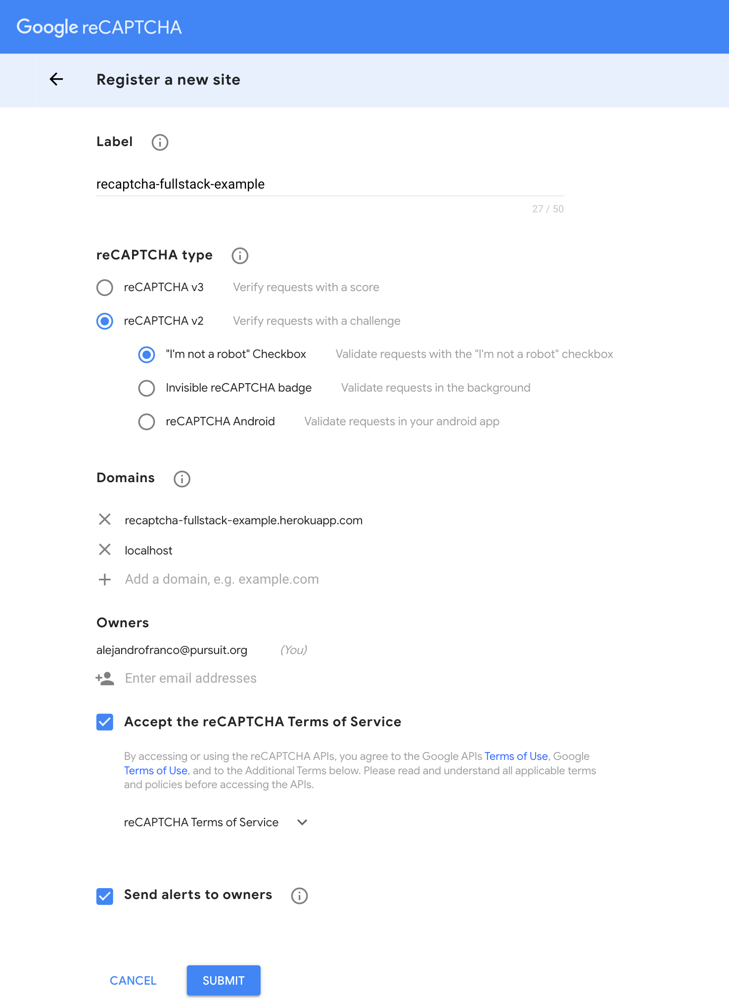
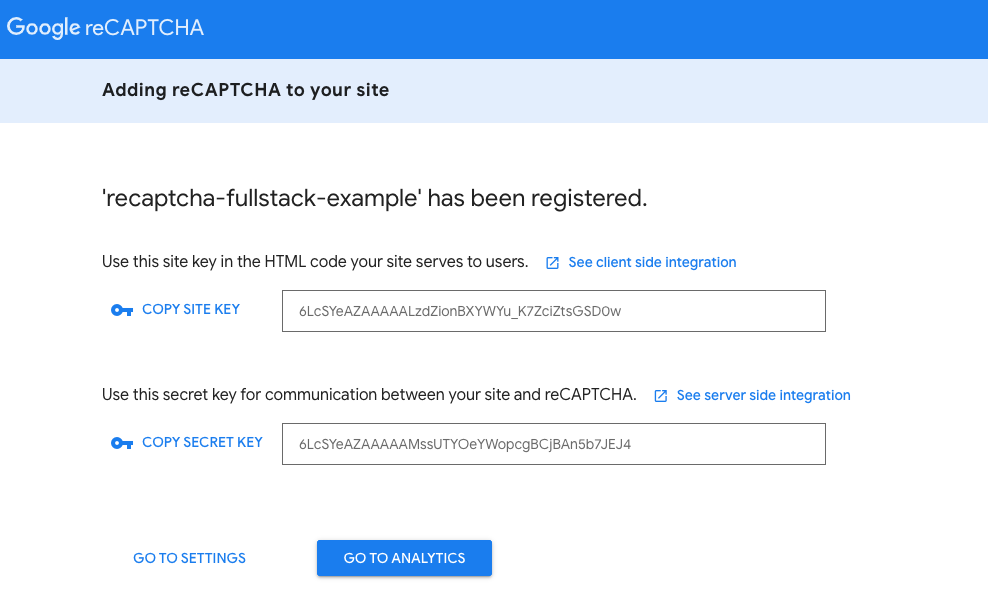

# reCAPTCHA v2: Protect your sites against bots and abuse

Today we will learn how to add a simple [reCAPTCHA](https://developers.google.com/recaptcha) checkbox to make sure the users of our app are humans and not bots that might want to spam or overload our app. 

We will use [reCAPTCHA v2](https://developers.google.com/recaptcha/docs/display) for the purposes of this lesson but there are is a [new version v3](https://developers.google.com/recaptcha/docs/v3) that doesn't require a checkbox at all that you might want to learn about later.

* if using firebase
* if implementing own user authentication

## Mindset
reCAPTCHA is a free service that protects your site from spam and abuse. It uses advanced risk analysis techniques to tell humans and bots apart. 

How does this work? Well, we will import some scripts and a checkbox widget that Google provides us and add them to our React App, in turn the reCAPTCHA checkbox/widget will be placed in the DOM. This reCAPTCHA uses Google's algorithms that monitor our page to tell apart actions that might come from real users or bots, for example if clicks are happening too fast or the user doesn't pass over other elements as they are moving their mouse it is likely a bot and it should be prevented to proceed further. If Google is not sure if your user is a bot just by their interactions with the page, it will present a reCAPTCHA challenge where the user will get asked to select images that match a certain description. Like "Select all images that contain Bicycles". Upon the user checking the checkbox or completing the challenge we are certain that the user is a human and we can let them keep interacting with our page.

Read [How does the “I’m not a robot” checkbox work?](https://medium.com/a-dose-of-curiosity/how-does-the-i-am-not-a-robot-checkbox-work-c24d426a82a1) 

## Steps

### 1. Clone [starter repo](https://github.com/joinpursuit/recaptcha-fullstack-example) [Optional]

### 2. Register site for reCAPTCHA

To use reCAPTCHA we first need to register a new site with Google's reCAPTCHA service.

Go to the [reCAPTCHA console](https://www.google.com/recaptcha/admin/create) and be sure to be logged in with your Pursuit Gmail Account. Any Google Account will do really.

Fill out the registration form as follows:
* **reCAPTCHA type** → reCAPTCHA v2 → "I'm not a robot" Checkbox"
* **Domains** → Add the domain where you have your app deployed for example `my-fullstack.herokuapp.com` and `localhost`
* **Accept the reCAPTCHA Terms of Service** → checked
* **Send alerts to owners** → checked
* Hit Submit

 Example Form Screenshot 📸

Once you submit the form you will be given two keys:
* **site key**: Is public facing and used in the front-end for the reCAPTCHA widget. 
* **secret key**: Is secret and will be used in the backend to verify the reCAPTCHA token an environment variable.

Copy you keys somewhere, we will use them in a bit.

 Example Keys 📸 

**Notes**:

* ⚠️ Once you have fully integrated reCAPTCHA and deployed remember to remove `localhost` from your domains settings

### 3. Install and set up `react-google-recaptcha` 

