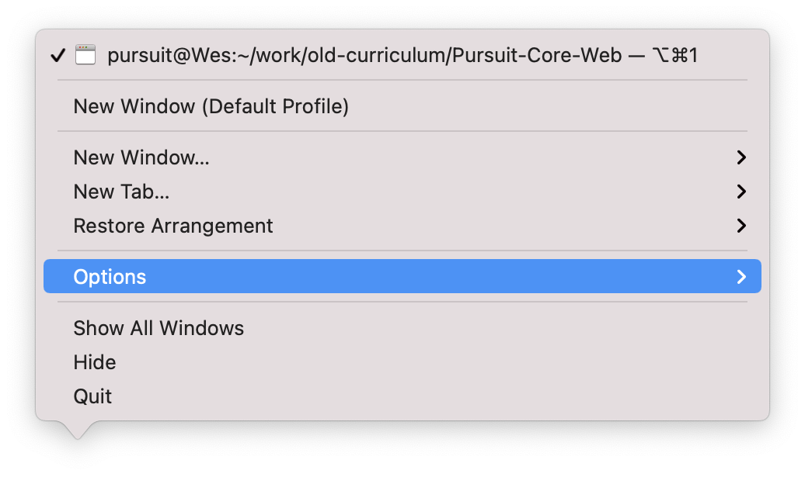
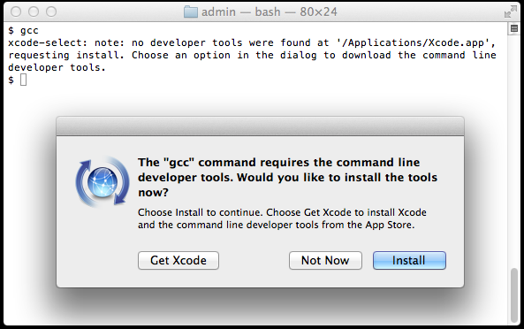

# Module 1 Mid-way

Please read the entire section before beginning.

**Notes:**

There are more specific details outlined below each list.

Please keep default settings unless otherwise specified. Later in the course, once you have grown comfortable with using the tools, you are welcome to work on configuring things further. However, to ensure a smooth learning experience, everyone should start out with the same software and configurations.

Download and install the following:

- [iTerm](https://iterm2.com/downloads.html) - A more feature rich terminal than what comes installed on your computer
- [Oh My Zsh](https://ohmyz.sh) - Additional features for terminal
- [Node](https://nodejs.org/en/download/) - This will allow you to run JavaScript on your computer, not just in the browser
- [Homebrew](https://brew.sh) - This will allow you to download additional software specific to coding/web development
- [VS Code](https://code.visualstudio.com/download) - This is where you'll begin writing your code on your computer and learn to launch your code locally. Many professional developers use VS Code on the job

> **Note:** You can open any program by searching for it with `Spotlight`. Click the magnifying class in the top right of your taskbar, or type <kbd>command</kbd> <kbd>space</kbd>. Once it's open you can type the name of the program you're looking for, then hit <kbd>enter</kbd> to open it.

### [iTerm](https://iterm2.com/downloads.html)

Download the latest stable release.

You can lock the icon in your dock for easy access. Two finger click on the icon in your dock, this will open up a menu.



**Note:** `terminal` and `iTerm` can be used interchangeably in documentation.

### [Oh My Zsh](https://ohmyz.sh)

Once iTerm is installed, open it using spotlight <kbd>command</kbd> <kbd>space</kbd> and then begin typing the name of the app until it appears:


and then follow the directions below to install ZSH. You can copy <kbd>command</kbd> <kbd>c</kbd> and paste the ZSH install command into iTerm by typing <kbd>command</kbd> <kbd>v</kbd>.


> **Note:** Anytime you see a command that starts with a `$`, ignore that symbol. The `$` indicates you're typing a command into the terminal, but it is not part of the command itself, and including it prevents the desired command from running.

Once ZSH is installed, completely close out of iTerm <kbd>command</kbd> <kbd>q</kbd> and reopen it.

If upon reopening, you receive the following error:

- `Insecure completion-dependent directories detected: `

Enter the following command and restart your terminal:

- `compaudit | xargs chmod g-w,o-w`

Read more in the following [Stackoverflow article](https://stackoverflow.com/questions/61433167/zsh-detects-insecure-completion-dependent-directories/61433333#61433333)

### [Node.js](https://nodejs.org/en/download/)

Choose the `lts` version.

After using the installer, verify node has installed by typing the following into terminal:

```bash
$ node -v
```

If it is installed it will output a version number like this

```
v16.4.1
```

If it is not installed, it will give an error saying something along the lines of `command not found`

### [Homebrew](https://brew.sh)

Homebrew is a package manager for macOS. This means we can use it to install other software from the terminal.

Go to https://brew.sh and paste the install command into your terminal.


> **Note:** If you get a prompt asking for your password, type it in. You may not see any feedback when typing in your password (number of keys pressed, like you normally may see in a browser), that's ok, finish typing and press enter.

At some point you will see an **alert box** (though the exact message may be different):



Click `Install` to download and install Xcode command line tools.

> **Note:** this may take a very long time!

After this process finishes, follow the remaining setup instructions that are displayed in the terminal, if there are any.

They will be in terminal like so


### Git

Git is a version control system that allows us to track, commit and revert changes to files within a directory.

When we installed homebrew, it should have installed `git`. To verify, type the following into terminal:

```
$ git --version
```

You should see the version output something like this:

```
git version 2.24.3 (Apple Git-128)
```

**IF GIT IS NOT INSTALLED:**

```sh
# install git only if it is not installed already
$ brew install git
```

Once git is installed, you can add some configurations:

```
# makes git terminal output pretty
$ git config --global color.ui true

# this will mark you as the 'author' of each committed change
# use your first and last name
$ git config --global user.name "your name here"

# use the email associated with your GitHub account
$ git config --global user.email your_email_here


# Optional - this will open VS code to allow you to write
# longer commit messages, rather than the default
# Text editor that is inside terminal
# use vscode as default editor
$ git config --global core.editor "code --wait"
```

### GitHub

Go to [GitHub](https://github.com), and create an account, if you have not already.

- It is best practice to make your github name your first and last name, or something similar. Why? Because future employers will look at your github. Keep it professional.
- Follow the [generating a PAT - personal access token](./pat-set-up)

### [Visual Studio Code](https://code.visualstudio.com/download) (VS Code)

Download a .zip file, double click it and follow the installation instructions.

The Visual Studio icon will appear on the directory you downloaded it next to the .zip file.

**IMPORTANT** Drag this icon to your `Applications` folder, which is on the left side of your Finder window. If you skip this step, any configuration changes will reset every time you restart VS Code.

**Install command to Launch VS Code from terminal**

Launch VSCode, and press <kbd>command</kbd> <kbd>shift</kbd> <kbd>p</kbd>(⌘⇧P), this will open up a prompt, type `shell command`.

The option to download **Shell Command: Install `code` command in PATH** will appear. Click on it and it will download it for you. This will enable you to type `code <name of file>` on your command line and open through your command line.

You can browse and install extensions from within VS Code. Bring up the Extensions view by clicking on the Extensions icon in the Activity Bar on the left side of VS Code or the View: Extensions command <kbd>command</kbd> <kbd>shift</kbd> <kbd>x</kbd> (⌘⇧X).

We recommend installing the below extensions:

- [Visual Studio Live Share](https://docs.microsoft.com/en-us/visualstudio/liveshare/use/vscode): real-time collaborative development on vscode.

- [Settings sync](https://marketplace.visualstudio.com/items?itemName=Shan.code-settings-sync): Synchronize settings, snippets, themes, file icons, launch, keybindings, workspaces and extensions across multiple machines using gitHub gist.

- [CSS Peek](https://marketplace.visualstudio.com/items?itemName=pranaygp.vscode-css-peek): Allow peeking to css ID and class strings as definitions from html files to respective CSS.

VS Code provides a rich and easy keyboard shortcuts, you can find a list on this [PDF](https://code.visualstudio.com/shortcuts/keyboard-shortcuts-macos.pdf). This list can also be found by using the shortcut ⇧⌘P and typing shortcut.
