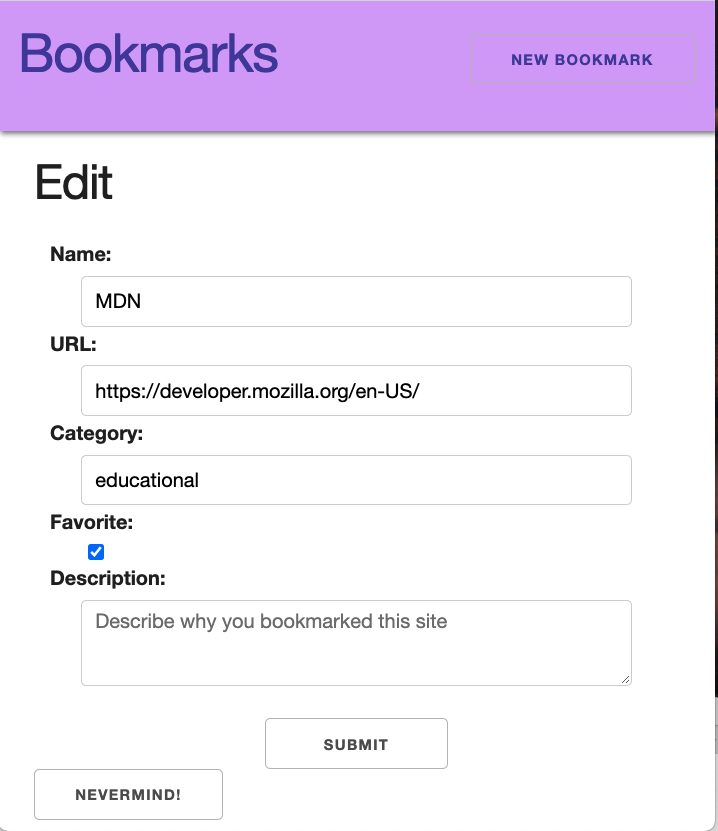

# Express Connect React

## Learning Outcomes

- Complete the remaining RESTful Routes
  - Show
  - New
  - Edit
  - Delete

## Continue

So far, we have added functionality to our React app to complete requests and get responses for Index.

Let's get the Show page, New, and Edit forms working

|  #  | Action |         URL         | HTTP Verb |   CRUD   |              Description               |
| :-: | :----: | :-----------------: | :-------: | :------: | :------------------------------------: |
|  1  | Index  |     /bookmarks      |    GET    | **R**ead | Get a list (or index) of all bookmarks |
|  2  |  Show  |   /bookmarks/:id    |    GET    | **R**ead | Get an individual view (show one log)  |
|  3  |  New   |   /bookmarks/new    |    GET    | **R**ead | Get a list (or index) of all bookmarks |
|  4  |  Edit  | /bookmarks/:id/edit |    GET    | **R**ead | Get an individual view (show one log)  |

### Loading a Bookmark on Page Load (Show Page)

If we click on the `pencil` it will take us to our show view in our React app.

<details><summary>Show Page Empty</summary>


</details>

Let's request one bookmark from our API from the show page.

**src/Components/BookmarkDetails.js**

At the top:

```js
import axios from "axios";
```

```js
import { apiURL } from "../util/apiURL";

const API = apiURL();
```

We are also using `useParams` from react-router-dom. This will allow us to use the url parameters (index position of the array)

Our function for show will be very similar. However, we'll add an error message in case the particular bookmark cannot be found. We'll got to `/not-found` which is an invalid index position, which will trigger the 404 route. It still could use even better UI/UX, but this will do for our small build. As a challenge during lab you can work on making this an even nicer experience.

Remember, the structure of the `.then()` function is that it takes two arguments, both callbacks. The first argument is what happens when the promise is successfully resolved (successful API call). The second is when the promise is rejected (unsuccessful API call) . The second callback is optional, but can be very helpful for debugging.

This code is typically split across several lines it can be hard to read. Here is the basic structure:

```js
.then(()=>{}, ()=>{})
```

Additionally, if the function only has one line of code, the curly braces can be skipped and the code can be shortened to:

```js
.then(response => response.data, error => error )
```

However, this style is very limiting, we can't add any extra lines of code. Se we'll write out the request in a a longer format that is easier to maintain.

**src/Components/BookmarkDetails.js**

Add a function to update bookmark

```js
const [bookmark, setBookmark] = useState([]);
```

Add useHistory so we can use the browser's [history api](https://v5.reactrouter.com/web/api/history)

```js
import { Link, useParams, withRouter, useHistory } from "react-router-dom";
```

Inside the `BookmarkDetails` function

```js
let history = useHistory();
```

Let's fetch one bookmark based on the index position. If the index position is invalid or not found, it will trigger the error callback, in which case, we will send the users to the 404 page.

```js
useEffect(() => {
  axios.get(`${API}/bookmarks/${index}`).then(
    (response) => {
      setBookmark(response.data);
    },
    (error) => {
      history.push(`/not-found`);
    }
  );
}, [index, history]);
```

<details><summary>Show Page Loaded</summary>


</details>

<br />

### Using the Create Form to Create a new Bookmark

<br />

When we think of our users, they want to create a bookmark and then want to see some sort of success that their bookmark has been created. So the flow will be:

- A user fills out the create form
- Presses the submit button
- Submit sends a post request to the express API
- Upon successful request, we'll redirect the user back to the index view, where they will see their bookmark added as the last item
- If there is an error, there will be a message in the console (again, during lab time, you can build a component/use conditional rendering to provide a better user experience, we won't do this in the interest of time)

**src/BookmarkNewForm.js**

```js
const addBookmark = (newBookmark) => {
  axios
    .post(`${API}/bookmarks`, newBookmark)
    .then(
      () => {
        history.push(`/bookmarks`);
      },
      (error) => console.error(error)
    )
    .catch((c) => console.warn("catch", c));
};
```

<br>

### Using the Edit Form to Create a new Bookmark

The edit form is very similar to the create form. However, for better user experience, it should be pre-filled with the values, rather than requiring the user to type everything from scratch.

**src/Components/BookmarkEditForm.js**

At the top:

```js
import axios from "axios";
```

```js
import { apiURL } from "../util/apiURL";

const API = apiURL();
```

```js
useEffect(() => {
  axios.get(`${API}/bookmarks/${index}`).then(
    (response) => {
      setBookmark(response.data);
    },
    (error) => history.push(`/not-found`)
  );
}, [index, history]);
```

Now, your form should be pre-loaded with the bookmark data.

<details><summary>Edit Form Loaded</summary>



</details>

Let's add the functionality to set a PUT request and update our API. Then we'll have the user return to the show page of the item they updated.

```js
const updateBookmark = () => {
  axios
    .put(`${API}/bookmarks/${index}`, bookmark)
    .then(
      (response) => {
        setBookmark(response.data);
        history.push(`/bookmarks/${index}`);
      },
      (error) => console.error(error)
    )
    .catch((c) => console.warn("catch", c));
};
```

## Adding Delete Functionality

For delete, we can just add a form on the show page. No separate page is needed.

**src/Components/BookmarkDetails.js**

```js
const handleDelete = () => {
  axios
    .delete(`${API}/bookmarks/${index}`)
    .then(
      () => {
        history.push(`/bookmarks`);
      },
      (error) => console.error(error)
    )
    .catch((c) => console.warn("catch", c));
};
```

## Summary

We have now created a full CRUD full-stack application, using an express backend and a create-react-app front end. We utilized all 7 RESTful routes.
