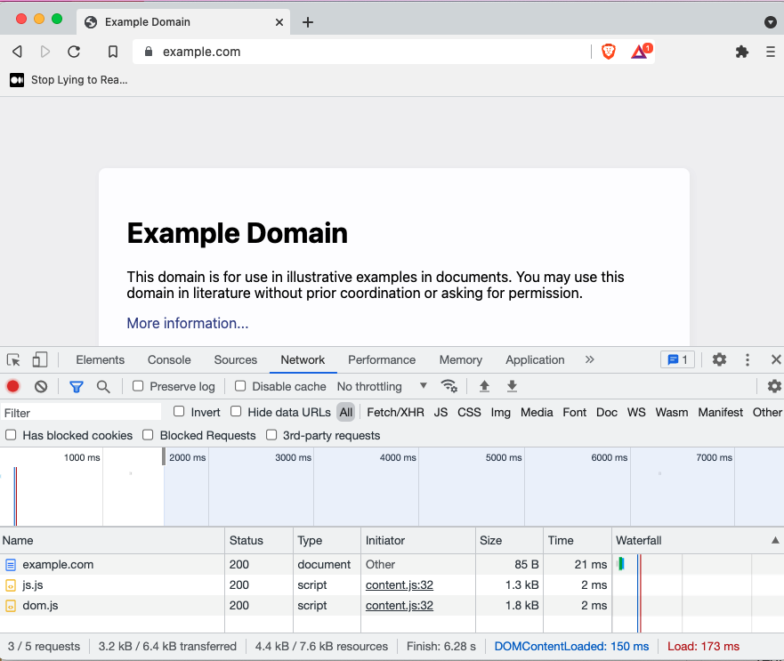

# Intro to the Internet and Servers

# Topics

Introductions to:

- [What is the Internet?](https://github.com/joinpursuit/Pursuit-Core-Web/blob/master/full-stack-express/intro-to-internet-and-servers/README.md#what-is-the-internet)
- [Clients](https://github.com/joinpursuit/Pursuit-Core-Web/blob/master/full-stack-express/intro-to-internet-and-servers/README.md#what-is-a-client)
- [Servers](https://github.com/joinpursuit/Pursuit-Core-Web/blob/master/full-stack-express/intro-to-internet-and-servers/README.md#whats-a-server)
- [Requests & Responses](https://github.com/joinpursuit/Pursuit-Core-Web/blob/master/full-stack-express/intro-to-internet-and-servers/README.md#types-of-requests)
- [URLs](https://github.com/joinpursuit/Pursuit-Core-Web/blob/master/full-stack-express/intro-to-internet-and-servers/README.md#different-parts-of-a-url)
- [HTTP](https://github.com/joinpursuit/Pursuit-Core-Web/blob/master/full-stack-express/intro-to-internet-and-servers/README.md#http)
- [HTTP Status Codes](https://github.com/joinpursuit/Pursuit-Core-Web/blob/master/full-stack-express/intro-to-internet-and-servers/README.md#http-status-codes)
- [BONUS: IP Addresses and DNS](https://github.com/joinpursuit/Pursuit-Core-Web/blob/master/full-stack-express/intro-to-internet-and-servers/README.md#bonus)

# Lesson

## What is the Internet?

Although the majority of us use the internet every day, many of us have not stopped to reflect or research how the internet actually works. We take for granted its seamless usage in our daily lives.

The Internet is the backbone of the World Wide Web (www or w3). The World Wide Web is an interconnected system of webpages that use the Internet in order to connect.

What started in the 1960s as a US military research project, soon evolved into a public infrastructure. The various technologies that support the Internet have evolved over time, but the way it works hasn't changed that much: Internet is a way to connect computers all together.

The initial purpose was to share articles and research papers. Now the internet has expanded to far more complex applications that are now part of our daily lives.

The internet is made up of two types of computer interactions: `clients` and `servers`.


### Client vs. Server

Computers connected to the web are called **clients** and **servers**. A simplified diagram of how they interact might look like this:


- <kbd>Clients</kbd> make `requests` to `servers`
- <kbd>Servers</kbd> make `responses` to `clients`

There is a lot more that happens under the hood, but we don't need to know it in order to build awesome web apps!

## What is a Client?

A client can be anything that connects to the internet in order to make `request`s to servers.

Things like:

- Laptops and desktop computers via web browsers like Chrome
- Smart phones via mobile apps
- IoT (Internet of Things): Smart fire alarms, smart door lock, smart bicycles etc.

## What is a Server?

A server is just a computer that runs software to take `requests` and send back `responses`.

You can make your own computer into a server. But in order for other computers to make requests to it, it would have to be on all the time in order to have uninterrupted service. And, if your web app gets very popular, your laptop will not be able to handle it, because it wasn't designed to be used for this as its main purpose. Therefore, there are typically dedicated computers for this purpose.

Here is an image server farm that full of computers that are servers:


### Types of Servers

1. **Web server**: Web servers show pages and run apps through web browsers. For example, if you are viewing this page on GitHub, your computer has made a request to the GitHub server for it to respond with this particular page.
2. **Email server**: Email servers facilitate the sending and receiving of email messages.
3. **FTP server**: FTP servers support the moving of files through File Transfer Protocol tools

## Types of Requests

There four common types of requests we can make which correspond to four basic ways we typically want to manipulate data

- `POST` (**C**reate data) - e.g. make a user account
- `GET`(**R**ead data) - e.g. see user account info
- `PUT/PATCH` (**U**pdate data) - e.g. update account info
- `DELETE` (**D**estroy data) - e.g. delete account

This acronym for create, reading, updating and deleting data is C.R.U.D.

## Different parts of a URL

URL stands for Uniform Resource Locator. It's a string of text characters used by Web browsers, email clients and other software to format the contents of an internet request message.


Let's breakdown the contents of a more complex URL:

```
    http://www.example.org:3000/hello/world/index.html?name=foo&limit=20#footer
    \___/  \_____________/ \__/ \___________________/ \_______________/ \____/
  protocol  host/domain    port           path            query-string hash/fragment
```

| Element          | About                                                                                                                                                                                                                                                                                                                                                     |
| ---------------- | --------------------------------------------------------------------------------------------------------------------------------------------------------------------------------------------------------------------------------------------------------------------------------------------------------------------------------------------------------- |
| protocol         | A protocol is a set of rules that is agreed to by all parties (in this case, a server and a client). The most popular application protocol used on the world wide web is HTTP(`S` stands for secure). Other familiar types of application protocols include FTP, SSH, GIT, FILE                                                                           |
| host/domain name | The host or domain name is looked up in DNS to find the IP address of the host - the server that's providing the resource (see bonus section)                                                                                                                                                                                                             |
| port             | A server can have multiple applications listening on multiple ports. This allows users to access a different application on the same host - this is usually configured for us, so we don't typically type it                                                                                                                                              |
| path             | Web servers can organize resources into a system that is similar to files in directories                                                                                                                                                                                                                                                                  |
| query-string     | The client can pass parameters to the server through the query-string (in a GET request method); the server can then use these to customize the response - such as values to filter a search result                                                                                                                                                       |
| hash/fragment    | This URL fragment is generally used by the client to identify some portion of the content in the response. If you are reading this on GitHub, you can hover over any header and click on it and it will update the URL, then you can copy the URL and send it to a someone and it will load the page at that header, rather than just starting at the top |

## HTTP

We are going to be working with HTTP (`Hyper-Text-Transfer-Protocol`) in order to build APIs.

**Remember** - `HTML` stands for `Hyper-Text Mark-up Langauge`

`HTTP` primarily sends data as strings. It has two main parts: a `header` and a `body`

The header contains important data about the request/response like

- `URL` - From where this resource is coming from
- `Method` - I.e. a `GET` request
- `Content-Type` - Types of data allowed. It can just be plain text/HTML or JSON or other files like images or videos
- `Status Code` - The status code (see below)

You can look at the headers by opening your browser's dev tools, going to the network tab and selecting a file.



The body contains any content that may be passing through. For example, the HTML, CSS and JavaScript of a web page or the contents that are coming from a form in the browser.

## HTTP Status Codes

HTTP Status Codes help convey information about requests/responses. For example - was it successful? Did it fail (think of a `404` status code - what does it mean? Have you seen a `404` status code on the internet?)

The status codes from 100 - 399, generally provide information that the request/response is normal/going through/successful.

The 400s typically denote user error, like trying to access a part of a site without being loggged in.

The 500s typically denote a server error. For example: The server has crashed.

For a memorable introduction see [HTTP Status cats](https://http.cat/), or if you would prefer [HTTP Status Dogs](https://httpstatusdogs.com/)

## Bonus

There are far more technical details of how the internet works. But we just need an understanding of the things we've covered in order to be able to build our own server.

### IP Addresses & DNS

### So what happens, exactly?

[Here is a popular 5 minute video](https://www.youtube.com/watch?v=7_LPdttKXPc)

When you type a web address into your browser:

1. The browser goes to the DNS server, and finds the real address of the server that the website lives on.
2. The browser sends an HTTP request message to the server, asking it to send a copy of the website to the client.
3. Provided the server approves the client's request, the server sends the client a "200 OK" message, and then starts sending the website's files to the browser as a series of small chunks called data packets.
4. The browser assembles the small chunks into a complete website and displays it.

#### Finding computers

- Source: [_How does the Internet work?_ by mozilla contributors](https://developer.mozilla.org/en-US/docs/Learn/Common_questions/How_does_the_Internet_work)

If you want to send a message to a computer, you have to specify which one. Thus any computer linked to a network has a unique address to identify it, called an **IP address**. It's an address made of a series of four numbers separated by dots, for example: `192.168.2.10`.

To make things easier for humans, IP addresses usually have a human readable alias called a **domain name**. For example, `google.com` is the domain name used on top of the IP address `173.194.121.32`. Using the domain name is the easiest way for us to reach a computer over the Internet.


The client and server we've described above don't tell the whole story. There are many other parts involved, and we'll describe some of them below.

- **DNS**: Domain Name Servers are like address books for websites. When you type a web address in your browser, the DNS needs to be reached first to translate the address to an ip address.
- **HTTP** (Hypertext Transfer Protocol): a protocol that defines how clients and servers speak to each other. **Remember** - HTML stands for `Hyper-Text Mark-up Langauge`
- **Component files**: A website is made up of many different files. These files come in two main types:
  - **Code files**: Websites are built primarily built from HTML, CSS, and JavaScript.
  - **Assets**: All the other stuff that makes up a website, such as images, music, video, Word documents, and PDFs.

[More in depth videos](https://www.khanacademy.org/computing/ap-computer-science-principles/the-internet/introducing-the-internet/v/what-is-the-internet?modal=1)
