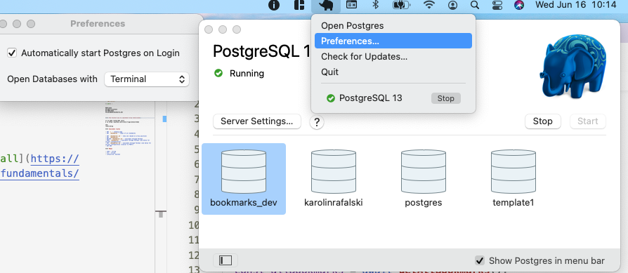
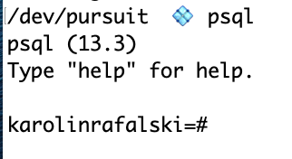
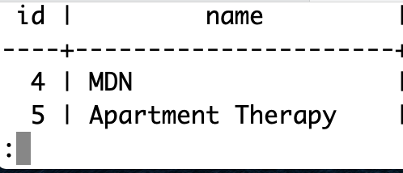

# Intro to Databases/SQL Part 1

## Lesson Objectives

- Define databases and their role in a full stack app
- Introduction to PostgreSQL
- Set up and drop (delete) a (sub) database
- Create table, set columns and drop the table
  - **C**reate a row and put it into the table (insert data)
  - **R**ead from the table (query data)
  - **U**pdate from the table
  - **D**elete from the table
- Bonus: Limit, Sorting and Aggregation

## Introduction

### What is a Database?

A database is an organized collection of data, stored and accessed electronically.

For our CRUD apps, so far, we've been hard coding some data to get started with. We were able to make some temporary changes, but as soon as we shut down or restarted the server, the changes would disappear.

We need a way to make our data persist, so that if the database is restarted or shut down we will still have the data. To do this, we'll use a database in order to store and access our data.

There are many databases. A common type is a relational database, which stores data in tables and rows, much like an excel or google spreadsheet. The way we will interact with these databases is using a coding language called SQL (Structured Query Language). There are a few popular like mySQL, Oracle, SQL Server, SQLite and PostgreSQL.

While a google sheet can hold hundreds or thousands of records, it isn't meant to hold millions or billions of records (think about a database that contains all the users of FaceBook). Additionally, we can relate different tables (sheets) which allows us to do very powerful things with data. We'll get to see this in action in the next lesson.

We'll be working with PostgreSQL (a successor to a database called `ingres`), which is an open source RDBMS (relational database management system) created at the University of California Berkeley. It started being built in 1982.

The [skeuomorphic representation of a database](https://en.wikipedia.org/wiki/Skeuomorph) is a stack of disks:


#### Extra Reading

It is [ACID-compliant](<https://en.wikipedia.org/wiki/ACID_(computer_science)>) and [transactional](https://en.wikipedia.org/wiki/Transaction_processing)

## Getting Started

You should have already downloaded PostgreSQL at the start of this course. [Pursuit Core Environment Set Up](https://github.com/joinpursuit/Pursuit-Core-Web/blob/master/fundamentals/local_environment/README.md#postgresql)

It should already be running and you should see an icon of an elephant in your Mac's bar


If you don't see it, but you've installed it use `spotlight` <kbd>command</kbd> <kbd>spacebar</kbd> to search and load it


You can configure PostgreSQL to always load on startup and stop/start your server from the icon



Today, we're going to use the PostgreSQL shell in terminal. To launch it, go _anywhere_ in Terminal and type

- `psql`



## SQL Syntax

Even though keywords in SQL are not case sensitive, the convention is to capitalize them

```sql
-- correct
SELECT * FROM bookmarks;

-- incorrect
select * from bookmarks;
```

**Note:** Comments start with two dashes `--`

## SQL's Big GOTCHAS

Postres in terminal gives you some cues, but they can be hard to spot as a new user.

A prompt that is ready to go is preceeded by `=#`


Semi-colons are required to end your statement. If you forget your semi-colon, the prompt will drop to the next line and appear as a `-#`


To fix this just add a semi-colon and press <kbd>return<kbd>


Another thing that can happen is that you get a lot of rows of data back and you may not want to scroll through them all. To `q`uit that view press `q`

You'll see a colon that will let you know there is more data, which you can use the down arrow to scroll through or press `q` to get your prompt back



## Create a Database

PostgreSQL is a Database. When you run the application, you can create `sub-databases` that allow you to work on different projects. For example, you may have one for your bookmarks app, one for your budgeting app and more. These sub-databases are most often referred to as `databases` and to create them you use the keyword `databases`.

Let's create a database and then drop (delete) it. Then we'll create a new one, connect to it and use it for the rest of this lesson

```SQL
-- create the sub database foo
CREATE DATABASE foo;

-- drop it
DROP DATABASE foo;

-- get started with our code along
CREATE DATABASE lesson_db;

-- connect to the lesson_db sub database
\connect lesson_db;

-- OR (does the same thing as connect, just shorthand)
\c lesson_db;
```

## Data types

As we've been using express and creating our data in the form of arrays inside of objects, we could play it fast and loose with datatypes. We could enter `4` as `4` (a number) or `'4'` - a string. JavaScript didn't care.

PostgreSQL is more strict and expects the correct data types in the columns we will create. here are some of the most common ones

1. int - whole number
1. decimal - float/decimal
1. bool - boolean
1. varchar(n) - small text
1. text - large text
1. timestamp - date

### Extra Reading

[Hello My Name is Mr. Null](https://www.wired.com/2015/11/null/)

## Create a Table

Inside of a database, we can have many tables. We'll create a table of houses for sale. We can imagine if we were working for a real estate company, we would have separate tables for buyers, agents, commercial properties etc.

Tables have columns and rows. We will define the names of the columns and their data types.

```SQL
-- describe your tables
CREATE TABLE foo ( name TEXT ); -- create a table called 'foo' with one column called 'name' which is a small text column

-- see table
\dt

-- drop a table
DROP TABLE foo;

-- 'houses' table has an id column `serial`, which is just a number that increases with each addition, and columns for address, city, st, price, and boolean properties for pool and for_sale.

CREATE TABLE
  Houses
  ( id serial, address TEXT NOT NULL, city TEXT, st varchar(2), price INT, pool BOOLEAN DEFAULT false, for_sale BOOLEAN);

-- show description of columns for the table houses
\d houses;
```

Additionally, we are adding an `id` - an id is a useful field. All of our data is subject to change, the hotel name can change, there can be a typo that needs fixing. An id is an unique identifier for each row. The key word [serial](https://www.postgresql.org/docs/9.2/datatype-numeric.html) provides us this functionality of increasing the id number automatically.


### Alter a Table

You can make changes to the table you've created.

**IMPORTANT:** You cannot roll back changes or undo deletes with a PostgreSQL database. When working in production, be sure to have back up systems in place.

```sql
-- add an test string column
ALTER TABLE houses ADD COLUMN test TEXT;

-- drop the test column
ALTER TABLE houses DROP COLUMN test;

-- rename a column
ALTER TABLE houses RENAME st TO state;

-- rename a table
ALTER TABLE Houses RENAME TO houses;
```

See columns in the houses table again

```sql
\d+ houses
```

## Insert Into The Table

You don't have to remember the order of the columns you created, but you have to match the order when inserting:

```SQL
INSERT INTO
    houses (address, pool, price, state, city, for_sale)
VALUES
('99 Sunnyside Drive', TRUE, 100, 'NY', 'Springfield', true);
```

**Success** will look something like

```SQL
INSERT 0 1
```

We can see our data by doing a query. The `*` (star) means show all the columns.

```SQL
SELECT * FROM houses;
```

You don't have to enter all the fields (only the required ones)

```SQL
INSERT INTO
    houses (address)
VALUES
('Graceland');
```

Remember, you can use the `up` arrow to scroll to previous commands to run

```SQL
SELECT * FROM houses;
```

again to see the new entry.

Let's add some more houses (copy paste from the notes into your terminal):

```SQL
INSERT INTO
    houses (address, city, state, price, pool, for_sale)
VALUES
    ('2 Maple Court', 'Monroe', 'NY', 200, false, true),
    ('50 Beech Street', 'Bacon', 'IN', 75, null , null),
    ('101 Willow Avenue', 'Twin Peaks', 'WA', 300, null, null),
    ('2300 Orchard Lane', 'Monroe', 'NC', 150, null, true),
    ('57 Sycamore Boulevard', 'Monroe', 'CT', 275, false, false),
    ('88 Hemlock Grove', 'Eek', 'AK', 200, true, true),
    ('109 Pine Drive', 'Happyland', 'CT', 220, false, null);
```

### Select from table

Here, we can start to explore some of the powerful queries we can make using SQL

```SQL
-- select all rows from the houses table.  display only the address column
SELECT address FROM houses;

-- select all rows from the houses table.  display only the address and state column
SELECT address, state FROM houses;

 -- select all rows from the houses table.  display only the all columns
SELECT * FROM houses;

-- select all rows from the houses table where the name column is set to 'Monroe'
SELECT * FROM houses WHERE city = 'Monroe';

-- select all rows from the houses table where the name column is set to 'ny' or 'Ny' or 'NY' (case insensitive)
SELECT * FROM houses WHERE state ILIKE 'NY';

-- select all rows from the houses table where the name column contains 'Drive'
SELECT * FROM houses WHERE address LIKE '%Drive%';

-- select all rows from the houses table where the city column is set to 'Monroe' AND the state column is set to 'CT'
SELECT * FROM houses WHERE city = 'Monroe' AND state = 'CT';

-- select all rows from the houses table where either the pool column is set to TRUE OR the city column is set to 'Twin Peaks'
SELECT * FROM houses WHERE pool = TRUE OR city = 'Twin Peaks';

-- select all rows from the houses table where the price is set to 200
SELECT * FROM houses WHERE price = 200;

-- select all rows from the houses table where the price column is not set to 180
SELECT * FROM houses WHERE price != 180;

-- select all rows from the houses table where the price column is greater than 165
SELECT * FROM houses WHERE price > 165;

 -- select all rows from the houses table where the price column is less than 165
SELECT * FROM houses WHERE price < 165;

-- select all rows from the houses table where the price column is greater than or equal to 165
SELECT * FROM houses WHERE price >= 165;

-- select all rows from the houses table where the price column is less than or equal to 165
SELECT * FROM houses WHERE price <= 165;

-- select all rows from the houses table where the price column is null
SELECT * FROM houses WHERE price IS NULL;

-- select all rows from the houses table where the pool column has a value
SELECT * FROM houses WHERE pool IS NOT NULL;

```

## Update a Row

```SQL
UPDATE houses SET pool = TRUE WHERE id = 7;
```

Typically actions like creating a new item, updating and deleting an item doesn't return any rows.

However, sometimes we want to be able to see the changes we made. We can add a `RETURNING` statement. This saves us from having to make a follow up query if we would want that data.

```SQL
UPDATE houses SET for_sale = TRUE WHERE id = 9 RETURNING *;
```

## Delete a Row

```SQL
DELETE FROM houses WHERE id = 1;
```

## Delete Many Rows and See the Address

```SQL
DELETE FROM houses WHERE pool = false RETURNING address, state;
```

## Quit PostgreSQL Shell

To quit `psql` type `\q`

## BONUS

### Limit

Our data set is very tiny right now. If we were to imagine a shopping site, we usually don't want to load hundreds or thousands of products at once. It would be very slow and typically unnecessary.

We can limit how many rows we get back

```SQL
-- select all rows from houses table, but show only the first row
SELECT * FROM houses LIMIT 1;
```

### Offset

If we were to imagine pagination for our store, we would also want to offset (start at a later row) for the responses on upcoming pages.

```SQL
-- For comparison to the next one
SELECT * FROM houses;
-- select all rows from houses table, but show only one row. Skip the first row
SELECT * FROM houses LIMIT 1 OFFSET 1;

```

### Sorting

It's important to not rely on the order you put things in the database as a form of sorting. When you need to sort your data, do so with specific SQL commands.

```sql
-- select all rows from houses table, order by name alphabetically
SELECT * FROM houses ORDER BY city ASC;

-- select all rows from houses table, order by name reverse alphabetically
SELECT * FROM houses ORDER BY city DESC;

-- select all rows from houses table, order by price ascending
SELECT * FROM houses ORDER BY price ASC;

-- select all rows from houses table, order by price descending
SELECT * FROM houses ORDER BY price DESC;
```

### Combination

```SQL
SELECT address, city, state FROM houses ORDER BY city, state ASC LIMIT 2 OFFSET 2;
```

## SUPER BONUS

### Counts and Aggregation

```sql
-- show the total number of houses.
SELECT COUNT(price) FROM houses;

-- divide all rows into groups by city and state.  Show the number of rows in each group.  Also show the city and state of each group
SELECT COUNT(*) address, city, state FROM houses GROUP BY city, state;

 -- Show the SUM of all the house prices.
SELECT SUM(price) FROM houses WHERE price IS NOT NULL;

 -- Show the SUM of all the house prices where the pool is true
SELECT SUM(price) FROM houses WHERE pool IS TRUE;

-- divide all rows into groups by whether or not they are for sale.  Show the AVG of the price of each group.  Also show the for_sale property of each group
SELECT AVG(price), for_sale FROM houses GROUP BY for_sale;

-- show the MIN price of houses.
SELECT MIN(price) FROM houses;

-- divide all rows into groups by for_sale.  Show the MIN of the price of each group.  Also show the for_sale of each group
SELECT MAX(price), for_sale FROM houses GROUP BY for_sale;

```
