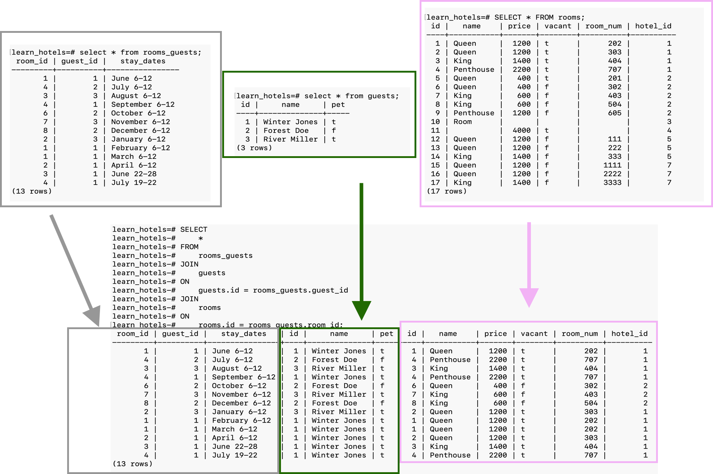
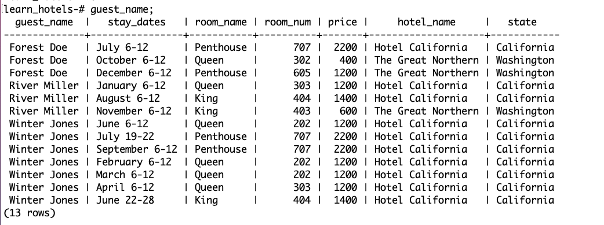

# SQL Part 2b

## Intro

Next up we can create tables with relationships of many to many. For example a guest can have (book) many hotel rooms and a hotel room can have (be booked by) many guests.

Let's make some guests. We can imagine we'd have info like a first name, last name, credit card number, email, phone, etc. But to keep things simple for this demonstration, our guests will only have one column for their name and whether or not they are traveling with a pet.

```sql
CREATE TABLE guests (id SERIAL PRIMARY KEY, name TEXT, pet BOOLEAN);
```

```sql
INSERT INTO guests (name, pet)
VALUES
('Winter Jones', true),
('Forest Doe', false),
('River Miller', true);

SELECT * FROM guests;
```

How can we create a table that allows for this relationship? If we try to add to rooms, we end up with a similar predicament when we first created our one to many relationship, same troubles if we try to tack on the data in some columns to the guests table.

To do this we're going to make a `join` or `look up` table. This table will have no serial primary key. The rows will be distinguished by the room id and the guest id. We can also add some additional info, for example the dates (we will use simple text for demonstration purposes)

```sql
CREATE TABLE rooms_guests (room_id INT, guest_id INT, stay_dates TEXT);
```

```sql
INSERT INTO rooms_guests (room_id, guest_id, stay_dates)
VALUES
(1,1, 'June 6-12'),
(4,2, 'July 6-12'),
(3,3, 'August 6-12'),
(4,1, 'September 6-12'),
(6,2, 'October 6-12'),
(7,3, 'November 6-12'),
(8,2, 'December 6-12'),
(2,3, 'January 6-12'),
(1,1, 'February 6-12'),
(1,1, 'March 6-12'),
(2,1, 'April 6-12'),
(3,1, 'June 22-28'),
(4,1, 'July 19-22');

SELECT * FROM rooms_guests;
```

While this table has data, it's not very useful for us to look at.

Let's do a query to show which rooms our guests have stayed in

Select all columns (all tables) from rooms_guests, join the table guests on where guests.id matches rooms_guests.guest_id match.

Join those results to rooms_guests on where rooms.id rooms_guests.room_id match.

```sql
SELECT
    *
FROM
    rooms_guests
JOIN
    guests
ON
    guests.id = rooms_guests.guest_id
JOIN
    rooms
ON
    rooms.id = rooms_guests.room_id;

```



## Bonus

- Show which hotels are associated with these rooms as well and update the three fields `name` to be `guest_name`, `hotel_name` and `room_name`.

- Additionally, show stay dates, price, and state and order by guest name.

**Expected Result**



## Lab Time

### Part 1

Finish Regifter, if you haven't

### Part 2

Choose Your Own Learning

Rate your comfort and choose the matching activity

| Rating |              What it means               |                                                                                                               What you should work on                                                                                                               |
| :----: | :--------------------------------------: | :-------------------------------------------------------------------------------------------------------------------------------------------------------------------------------------------------------------------------------------------------: |
|   5    | I feel amazing! Give me more challenges! | [Football/Futball/Soccer Data](https://github.com/jokecamp/FootballData/tree/master/openFootballData) Download and join the many tables to create info on historical data, like which players are on what teams? Who scored what goal in what game? |
|   4    |               Feeling good               |                                                                                     Go back to the bonus challenges in the lecture markdowns and solve each one                                                                                     |
|   3    |             Hanging in there             |                                                                                                 [Work your way through SQL Zoo](https://sqlzoo.net)                                                                                                 |
|   2    |           I'm feeling stressed           |                                                                                                [Work your way through SQL Bolt](https://sqlbolt.com)                                                                                                |
|   1    |           What just happened?            |                                                                                          Take a break and then schedule a time to talk to your instructor                                                                                           |
