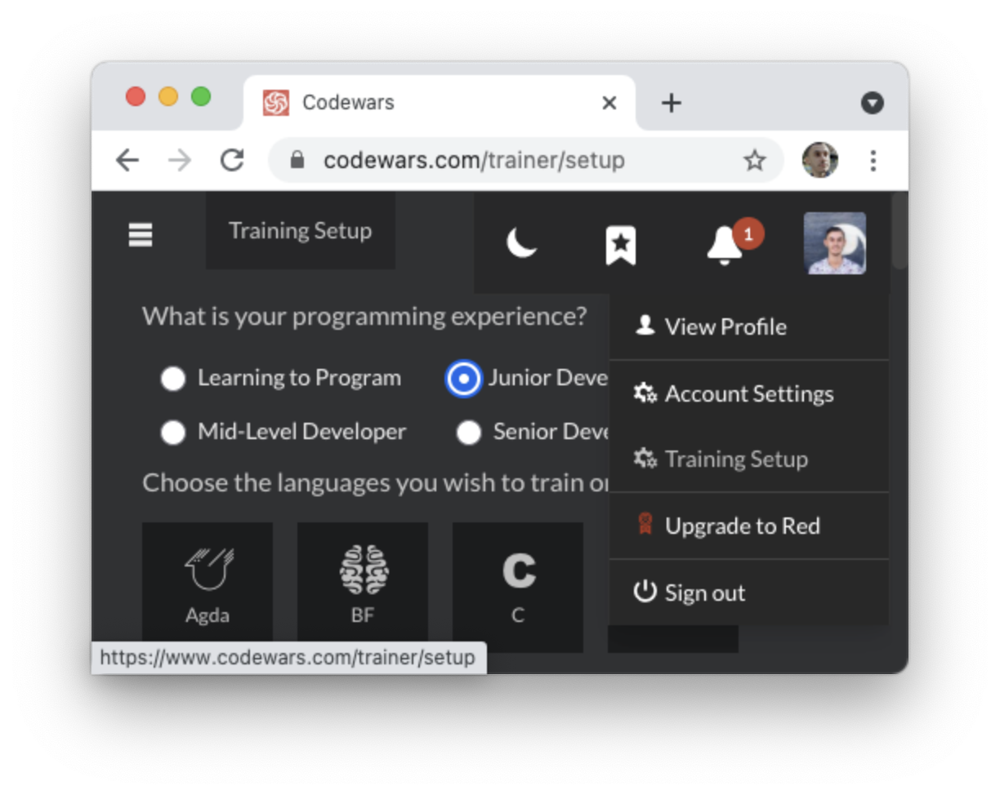
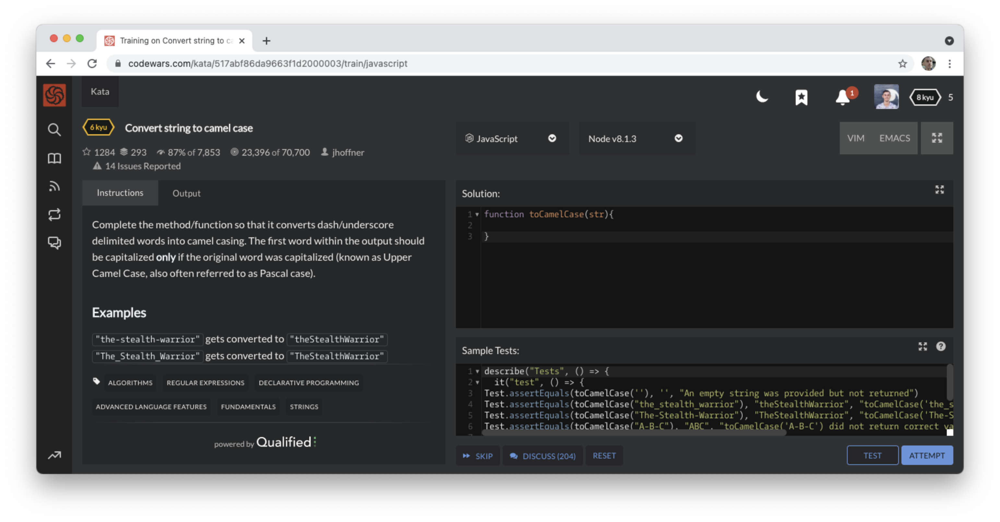
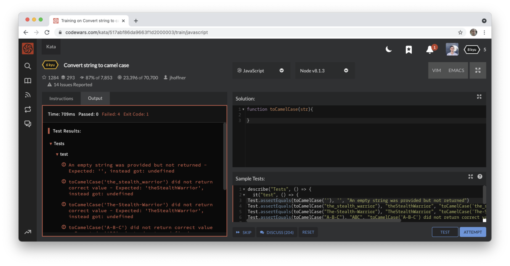
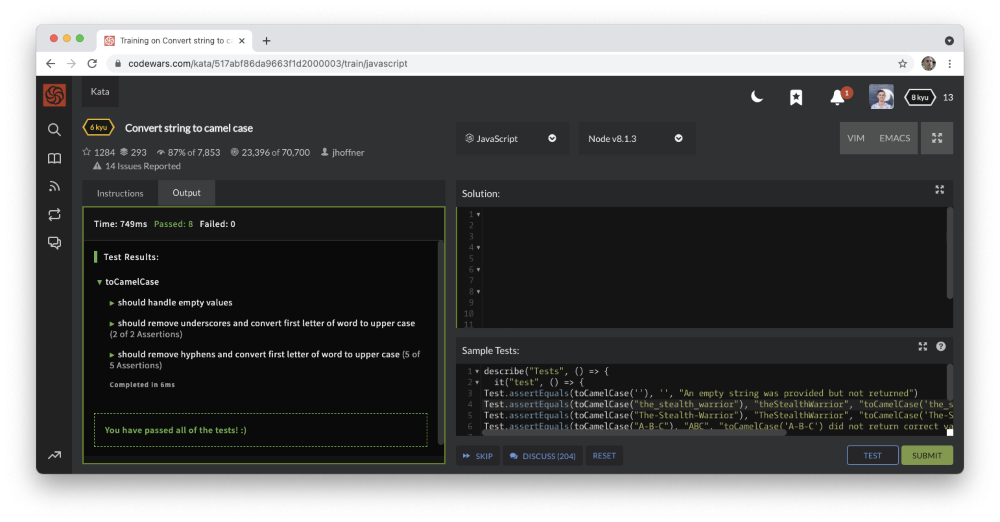

# Algorithm Challenges

## Learning Objectives

By the end of this lesson you should be able to:

- Describe the purpose of working on code challenges from external sites like Codewars.
- Solve code challenges using online IDEs.

---

## Code challenges

As part of the interview process for many companies, you will be asked to complete a code challenge. These challenges are designed to test your coding ability as well as more generally see how you go about solving a problem. At times these challenges will seem contrived. However, you will need to be able to solve these kind of challenges if you wish to make it to the next step of the interview process.

### Goals of code challenges

Companies are often assessing one or more of the following:

- Your ability to understand a complex problem and potentially ask questions.
- Your ability to write understandable and clear code.
- Your ability to solve problems efficiently and elegantly.
- Your ability to communicate technical concepts.

For a junior developer role at a company, it is not always critical that you excel in every single one of these categories. However, doing your best across the board will increase your chances of landing a job.

### Code challenge formats

Code challenges can be completed in a number of ways. Some of the most popular include:

- Being sent a code challenge on a popular website with a deadline for submission.
- Solving a code challenge with interviewers present, typically called "white boarding."
- Pairing with a developer in-person or remotely, with you being the main driver.

Many companies use a mix of these approaches when hiring for roles. Depending on the format, these experiences can cause a lot of anxiety. One of the best ways to feel better about doing code challenges is to simply do a lot of them.

## Getting practice

There are a number of websites on the internet that can provide code challenges. Many of these websites have a range of difficulties as well as different types of IDEs to use. Regardless of the website, the shape of challenges are often the same. Usually you will be given a detailed prompt of a function to write with a number of requirements. You will then be given some tests to run to verify the function you've written. Often times there will also be some hidden tests that are run when you submit your code.

One of the most popular websites for challenges is [Codewars.com](https://codewars.com).

### Codewars

Codewars is run by a company called Qualified, which makes software for companies to hire developers. The site has a number of popular coding challenges and allows for users to solve those challenges in a number of languages.

When you sign-up with Codewars, you can choose to do so via email or GitHub. Once you've done so, you'll be able to pick and choose the types of problems you would like to work on.

#### Katas

Codewars describes challenges as [katas](https://docs.codewars.com/concepts/kata) and uses a rating system called "kyu". The lower the "kyu" of a challenge, the more difficult it is.

You are welcome to use the system's search feature to find katas to work on, or use the Training Setup feature to have different katas suggested to you.

Once you've chosen a kata, you'll be brought to a page that has the Codewars IDE embedded into it.

#### Solving code challenges

Each kata looks similar. On the left, you'll see a description of what you need to do. On the right, you'll see an area for you to write your code as well as an area where you can see some of the sample tests that will be run.

Additional information and options are included along the top and bottom of the page.

One of the first things you can do is press the Test button. This will run the sample tests and show you any failures.

You should then write the code you need to pass the tests.

Once you think you've gotten it right, you can press the Attempt button. This will attempt to submit your code, running it against additional hidden tests.

If those tests pass, you will then be given a green Submit button where you can submit your challenge, saving it to your profile.

On the next page you'll be shown different solutions by other members of Codewars who have solved the same kata. While this is often interesting to look at, don't necessarily assume that other solutions are any better than yours.

### Additional sites

There are a number of additional sites that can be used to practice coding. While it's worthwhile to practice these challenges now, don't forget that these kinds of challenges are only one component of interviewing for technical positions.

#### Coding challenge websites

- [Edabit](https://edabit.com/)
- [Exercism.io](https://exercism.io/)
- [HackerRank](https://www.hackerrank.com/)
- [LeetCode](https://leetcode.com/)
- [CoderByte](https://coderbyte.com/)
- [CodeSignal](https://codesignal.com/)
