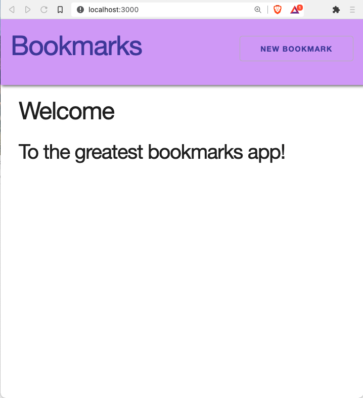
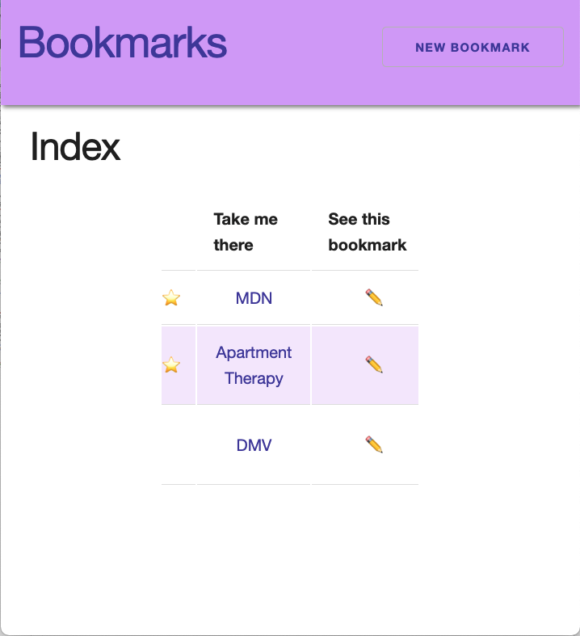

# Express Connect React

## Intro

By now we have a nicely working back-end with full CRUD using express. Unfortunately, it isn't the best user experience for non-developers. We need to build a front-end.

## The Seven RESTful Routes

The seven RESTful routes are often the classic example of a RESTful pattern. Every `GET` request must have a view. We have some new views we must make for our users. For example: Users must be able to see a form in order to make a new bookmark/access the `update` route.

While this pattern is classic and we will follow it exactly for learning fundamentals, you will see many variations in the wild. These variations are to meet specific needs of functionality and/or to improve user experience.

We have built the first 5 routes in Express:

|  #  | Action  |      URL       | HTTP Verb |    CRUD    |              Description               |
| :-: | :-----: | :------------: | :-------: | :--------: | :------------------------------------: |
|  1  |  Index  |   /bookmarks   |    GET    |  **R**ead  | Get a list (or index) of all bookmarks |
|  2  |  Show   | /bookmarks/:id |    GET    |  **R**ead  | Get an individual view (show one log)  |
|  3  | Create  |   /bookmarks   |   POST    | **C**reate |            Create a new log            |
|  4  | Destroy | /bookmarks/:id |  DELETE   | **D**elete |              Delete a log              |
|  5  | Update  | /bookmarks/:id |    PUT    | **U**pdate |              Update a log              |

<br />

The next four are ones that we will build in our front-end:

|  #  | Action |         URL         | HTTP Verb |   CRUD   |              Description               |
| :-: | :----: | :-----------------: | :-------: | :------: | :------------------------------------: |
|  1  | Index  |     /bookmarks      |    GET    | **R**ead | Get a list (or index) of all bookmarks |
|  2  |  Show  |   /bookmarks/:id    |    GET    | **R**ead | Get an individual view (show one log)  |
|  3  |  New   |   /bookmarks/new    |    GET    | **R**ead | Get a form to create a new bookmark    |
|  4  |  Edit  | /bookmarks/:id/edit |    GET    | **R**ead | Get a form to update a bookmark        |

Which two are new and which ones have we built with express?

## Getting Started

- Go to your bookmarks app and get it started with `nodemon`
- Open a new tab in terminal, do not shut down your bookmarks app
- Fork this [Starter code](https://github.com/joinpursuit/bookmarks-react-starter)
- `git clone` the forked repository
- `cd` to the directory where you cloned it
- `npm install` to install dependencies that are already included in the `package.json`
- `npm start`

## Landing Page/Index

<details><summary>Landing Page</summary>



</details>

Let's click on `Bookmarks` in the navigation to go to `/bookmarks`

<details><summary>Index Page Empty</summary>


</details>

We can see that we have a view for our index page. But, we need to connect this app to our back-end. We can do so using `axios` much like we did when we were using third party APIs.

## Setting Up the App to Make Requests

### The Base URL

Before we get started, we have to think about a problem we are going to have. If we hard code `http://localhost:3003` into our react app, when we change it to be hosted online, we would have to go in to our app and change every single instance of `http://localhost:3003`- further if we decide to host our app on another service, we would have to go in and change it again.

So, the way we are going to solve this is by using a bit of JavaScript logic.

There is a new folder inside your `src` folder called `util` - it is short for utility, and it's going to be a simple function that is going to determine the base of our URL.

The function is going to check whether the browser window's location has a `hostname` of `localhost`

If true, the base url will go to `http://localhost:3003` (where our Bookmarks API is running)

Else, connect it to some online hosted version of the API. When you build your own API and put it on the web, you'll get a different URL. The one listed is just a sample one that you can use as a reference when you are ready to deploy.

```js
export const apiURL = () => {
  return window.location.hostname === "localhost"
    ? "http://localhost:3003"
    : "https://sheltered-island-89188.herokuapp.com";
};
```

Bring in this string in to

**src/App.js**

At the top:

```js
import { apiURL } from "./util/apiURL";

// further down..., but below `App` component
const API = apiURL();
```

### Adding Axios

- open another tab in terminal so you can keep your react app running.
- `npm install axios`

**src/App.js**

At the top :

```js
import axios from "axios";
```

### Loading the Bookmarks Index on Page Load

With React, we sometimes have to think about _when_ things happen. For us, we want to make an API call to get our data AFTER the component has been fully loaded (mounted in the DOM) and then update state.

If we made the API call first and the DOM was not fully loaded and state was updated first, we would risk not seeing our data, even though the API call was successful.

React has a built-in function called `useEffect` that is going to control _when_ the functions inside are called.

This is where we are going to add our initial API call in order to get all the bookmarks.

The `useEffect` function is already in **app.js**, but it is empty. Let's add some code

- Make a `get` request using axios. `Then` when there is a `response` do something. In our case, we want to update state using hooks by using the `setBookmarks` that was declared at the beginning of the `App` component. The state will be updated to be our array of bookmark objects.

```js
useEffect(() => {
  axios
    .get(`${API}/bookmarks`)
    .then(
      (response) => setBookmarks(response.data),
      (error) => console.log("get", error)
    )
    .catch((c) => console.warn("catch", c));
}, []);
```

**Uh Oh!** We found a ~~bug~~ feature!


Our React app is making a request from a different origin than where our API is running. This is a great security feature!

However, we want to allow our React app to make requests to our API.

We will have to go to our express api in order to set up this allowance.

#### Express API

**terminal**

- `npm install cors`

**app.js**
Near the top

```js
const cors = require("cors");
```

**near `app.use(express.json())`**

```js
app.use(cors());
```

This will allow ANY app to make requests to your API. Since we are just building a sample app and not hosting it online, we don't have to worry about restricting it right now. Later, when you have your app deployed in the cloud, you would want to be more thoughtful about how to properly allow/restrict access.

**Success:**

<details><summary>Index Page Loaded</summary>



</details>

<br />
