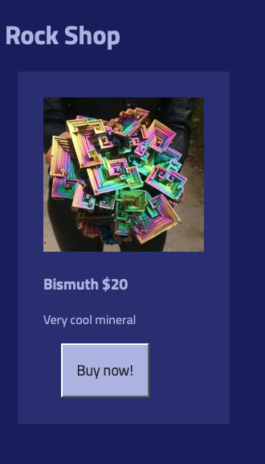

# 3 Express CRUD/MVC

## Intro

Let's take a moment to think about a web site like Etsy. Etsy has thousands of shops and millions of products.

When a shop owner decides to sell a new product, they just enter the data about the new product: name, price, image(s), description etc. And almost immediately, a new web page appears!

How is this happening? Etsy doesn't have a bunch of devs sitting around at the ready to hand roll a new web page. Rather, the developers build an HTML template and then, based on data provided **embed** (insert) the data into the HTML

Let's look at an example - this is some data provided by an etsy shop owner through an online form:


When the owner presses the `submit` button. The browser will send a `request` to a server. The server will save the data in a database. We can imagine the data looks something like this:

```js
{
    name: 'bismuth',
    price: 20,
    image: 'bismuth.png',
    description: 'very cool mineral',
    shopName: 'Rock Shop'
}

```

The server will `respond` with some sort of confirmation that the `request` went through successfully, or will provide an error message.

Then, when the owner wants to see the product. The owner will make a `request` to see the product in the browser. There will be a `response` that will involve some logic to **embed** the data inside HTML:

```html
<h1>{rock.shopName}</h1>
<div class="card">
  
  <h3><span>{rock.name}</span> {rock.price}</h3>
  <p>{rock.description}</p>
</div>
```

And then it gets rendered in the browser:



There are four main things to do with data **C**reate, **R**ead, **U**pdate, and **D**elete. In the above case, a user created some data, and then read the newly created data. We can imagine at some point the user may want to update the price or delete the item altogether.

We're going to be building a webpage bookmarks app. It's going to be a very simple app which will teach the fundamentals of building an API with express. Later, we'll add a react front-end to consume the API. Finally, we'll learn about databases and integrate a database into our simple app.

Once we have our fundamentals down, we can start building more complex apps with real world applications.

## Getting Started

We are going to be building this app over several sessions, so let's make sure we put it on github and commit often!

- some commands

## Software Architecture: MVC

The apps we are building in class are very small. Even with our small apps it can be very easy to get lost in our code. Where did we create a certain function? What file is displaying what we see in the browser? Organizing and maintaining code is quite challenging!

Our problems are a microcosm of an app that is years old that have had tens or possibly hundreds of developers work on it. Therefore, developers who are far more experienced have worked on creating conventions, frameworks, styles and patterns that are easy to maintain, collaborate and reuse.

**Bonus:** [Read more on software architecture](https://en.wikipedia.org/wiki/Software_architecture)

We are going to be loosely following a very common software design pattern called [MVC](https://en.wikipedia.org/wiki/Model–view–controller) : Model-view-controller

This allows developers to separate the concerns of the data, the view and the controller.

A common metaphor for this is a restaurant. Imagine that a customer coming in and sitting down interacts with the menu and dishes (views). There is a chef in the back that takes the orders and makes food (models). Finally, there is a server that goes between the two (controller).

Everyone in the restaurant has a clear idea of what they are responsible for, otherwise the restaurant likely would not succeed. Imagine if the customers could at any moment go in the back and start cooking or the servers stopped ringing up orders!

Even though there is a common pattern for a restaurant, there are many variations, like buffets, drive-through and more. A pattern is a recommendation, not a rule.

So let's get back to our application. We are going to have a place for our models (data), or views (what users will see in the browser) and the contollers (logic between the two)

In terms of code, we will have a folder called `models`, a folder called `controllers` and while it is possible to have a `views` folder (and there are many applications that use this folder), we are going to be serving our views not from inside our app, but with a separate react app.

## TO DO INSERT SOME SCREENSHOTS/GIFS OF THE WORKING APP
