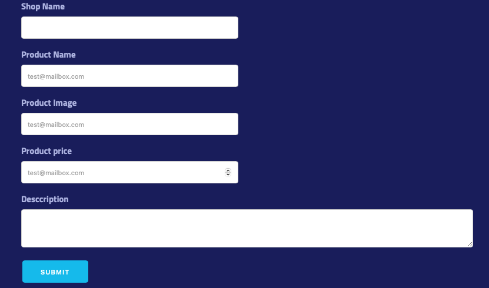

# 3 Express CRUD/MVC

Let's take a moment to think about a web site like Etsy. Etsy has thousands of shops and millions of products.

When a shop owner decides to sell a new product, they just enter the data about the new product: name, price, image(s), description etc. And almost immediately, a new web page appears!

How is this happening? Etsy doesn't have a bunch of devs sitting around at the ready to hand roll a new web page. Rather, the developers build an HTML template and then, based on data provided **embed** (insert) the data into the HTML

Let's look at an example - this is some data provided by an etsy shop owner through an online form:



When the owner presses the `submit` button. The browser will send a `request` to a server. The server will save the data in a database. We can imagine the data looks something like this:

```js
{
    name: 'bismuth',
    price: 20,
    image: 'bismuth.png',
    description: 'very cool mineral',
    shopName: 'Rock Shop'
}

```

The server will `respond` with some sort of confirmation that the `request` went through successfully, or will provide an error message.

Then, when the owner wants to see the product. The owner will make a `request` to see the product in the browser. There will be a `response` that will involve some logic to **embed** the data inside HTML:

```html
<h1>{rock.shopName}</h1>
<div class="card">
  
  <h3><span>{rock.name}</span> {rock.price}</h3>
  <p>{rock.description}</p>
</div>
```

And then it gets rendered in the browser:


