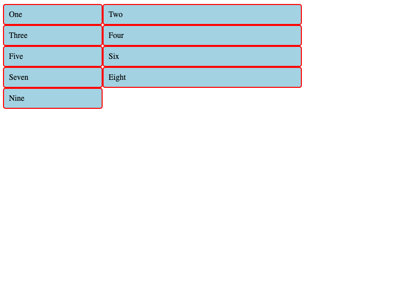
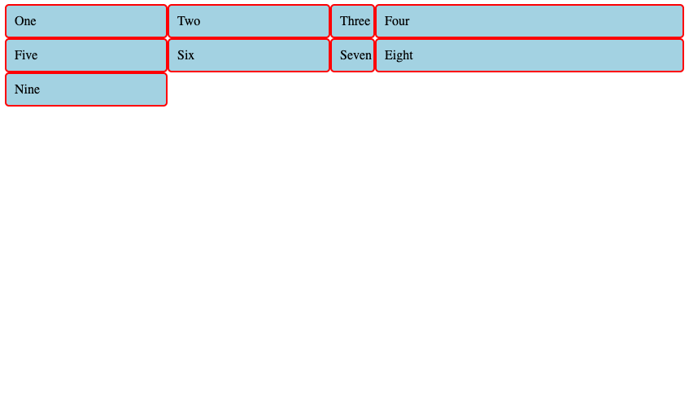
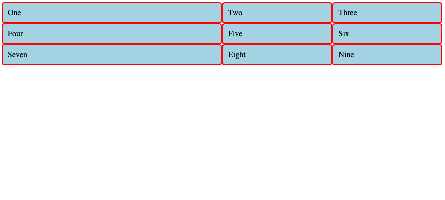
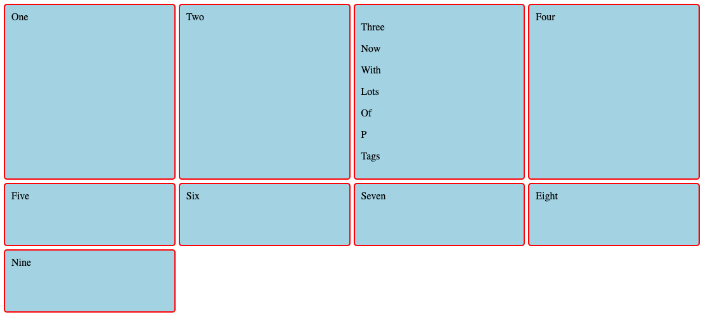

# CSS Grid

## Goals
* Understand the advantages of using CSS Grid.
* Know how to initiate a CSS Grid.
* Be able to manipulate elements inside of a grid.
* Know basic grid calls.

## Keywords
* Rows
* Column
* Grid
* Responsive

# 1. CSS Grid Introduction

CSS Grid is the newest and hottest thing to change about CSS. This is something that was added after Flexbox and uses a lot of
the familiar flexbox commands that we've grown to know and love.

CSS Grid Layout is a two-dimensional layout system for the web.
It lets you lay content out in rows and columns, and has many features that make building complex layouts straightforward.
Essentially, it's displaying your HTML elements on a preconceived grid. This allows for easy responsive design and gives us
developers lots of control about where we want to place our elements on the screen.

To start, create two new files: grid.html, and grid.css.

Copy the following code into your HTML:

```html
<!DOCTYPE html>
<html lang="en" dir="ltr">
  <head>
    <meta charset="utf-8">
    <title>GRID!</title>
    <meta name="viewport" content="width=device-width, initial-scale=1">
    <link rel="stylesheet" href="./grid.css">
  </head>
  <body>
    <div class="container">
     <div class="one">One</div>
     <div class="two">Two</div>
     <div class="three">Three</div>
     <div class="four">Four</div>
     <div class="five">Five</div>
     <div class="six">Six</div>
     <div class="seven">Seven</div>
     <div class="eight">Eight</div>
     <div class="nine">Nine</div>
   </div>
  </body>
</html>
```

Add this styling to your CSS file:


```css
.container div {
  border-radius: 5px;
  padding: 10px;
  background-color: lightblue;
  border: 2px solid red;
}
```


Now, let's see how we can use grid to style our display further.

# 2. Creating a grid with columns

To define a grid we use the grid value of the display property. Inside your CSS add the code:

```css
.container {
  display: grid;
}
```

Unlike flexbox, the when we open our new page, it looks exactly the same as before. Declaring display: grid gives you a one column grid, so your items will continue to display one below the other as they do in normal flow.

To see something that looks more like a grid we can add some columns. Add the grid-template-columns property to your container:

```css
.container {
  display: grid;
  grid-template-columns: 200px 200px;
}
```



Using the `grid-template-columns` property, we specified that we needed exactly 2 columns, both with a width of 200 pixels.  We can add additional columns by adding more values to the property.  They can even be different sizes:

```css
.container {
  display: grid;
  grid-template-columns: 200px 200px 55px 380px;
}
```



We can also use different units instead of pixels.  `fr` stands for "fraction" and allows us to set the relative size of each column.  The css below will make 3 columns, where the first one is twice as big as the other two:

```css
.container {
  display: grid;
  grid-template-columns: 2fr 1fr 1fr;
}
```




Note that as you adjust the size of the window, the columns stretch or shrink to fill up the window.

How would you make a grid with 4 columns of equal size?

<details>
<summary>Solution</summary>

```css
.container {
  display: grid;
  grid-template-columns: 1fr 1fr 1fr 1fr;
}
```
</details>


It's a little repetitive to have to repeat 1fr ourselves.  If we had 10+ columns, that'd be a lot of repetition.  Fortunately, grid has a `repeat` keyword that allows us to duplicate an element:


```css
.container {
  display: grid;
  grid-template-columns: repeat(4, 1fr);
}
```


We can also combine `fr` and `px`.  The css below will have one column take up 200 pixels, and split the remaining space evenly among two additional columns:

```css
.container {
  display: grid;
  grid-template-columns: 200px 1fr 1fr;
}
```

# 3. Styling the grid: grid-gap and grid-auto-rows


Just like we saw with flexbox, we can further set how content should be laid out.  The css below will add some space in between our divs using the `grid-gap` property.

```css
.container {
  display: grid;
  grid-template-columns: repeat(4, 1fr);
  grid-gap: 5px;
}
```


These gaps can be any length unit or percentage except `fr`.


So far we have only been working with columns, and rows have automatically been created. By default, these rows have been auto-sized. We can control the height of these auto rows.  The css below will set the height of all rows to 100px:

```css
.container {
  display: grid;
  grid-template-columns: repeat(4, 1fr);
  grid-gap: 5px;
  grid-auto-rows: 100px;
}
```


This looks good, but what happens if we were to have an item that was taller than 100px?

The CSS and HTML below illustrate an example:


```html
<!DOCTYPE html>
<html lang="en" dir="ltr">
  <head>
    <meta charset="utf-8">
    <title>GRID!</title>
    <meta name="viewport" content="width=device-width, initial-scale=1">
    <link rel="stylesheet" href="style.css">
  </head>
  <body>
    <div class="container">
     <div class="one">One</div>
     <div class="two">Two</div>
     <div class="three">
        <p>Three</p>
        <p>Now</p>
        <p>With</p>
        <p>Lots</p>
        <p>Of</p>
        <p>P</p>
        <p>Tags</p>
     </div>
     <div class="four">Four</div>
     <div class="five">Five</div>
     <div class="six">Six</div>
     <div class="seven">Seven</div>
     <div class="eight">Eight</div>
     <div class="nine">Nine</div>
   </div>
  </body>
</html>
```

```css
.container div {
    border-radius: 5px;
    padding: 10px;
    background-color: lightblue;
    border: 2px solid red;
  }  

  .container {
    display: grid;
    grid-template-columns: repeat(4, 1fr);
    grid-gap: 5px;
    grid-auto-rows: 100px;
  }
```


We can solve this by using the `minmax(min, max)` function:

```css
.container {
  display: grid;
  grid-template-columns: repeat(4, 1fr);
  grid-gap: 5px;
  grid-auto-rows: minmax(100px, auto);
}
```




Sometimes it is helpful to be able to ask grid to create as many columns as will fit into the container. We can do this by combining several of the techniques above:

Change your css for the container class to the following.  Here, we use `auto-fill` instead of a number to say that we should repeat as many columns as can fit.  Each column should be at least 200 pixels, and should be the same size as each other.

```css
.container {
  display: grid;
  grid-template-columns: repeat(auto-fill, minmax(200px, 1fr));
  grid-gap: 5px;
  grid-auto-rows: minmax(100px, auto);
}
```


# 4. Placement items inside of a grid

You can think of your grid made up of lines. The count starting at 1. This is the first line on the left side, and the first line on the top. We can place items onto the grid by using these commands:

* grid-column
* grid-row

These let you specify the start and end lines at once, separated by a / — a forward slash character.

Let's see this in action:

First change you CSS file to look like this:

```css
.container div {
  border-radius: 5px;
  padding: 10px;
  background-color: lightblue;
  border: 2px solid red;

}

.container {
  display: grid;
  grid-template-columns: repeat(3, 1fr);
  justify-content: center;
  grid-gap: 5px;
  grid-auto-rows: minmax(100px, auto);
}
```

Using `grid-row` and `grid-column`, we can specify how much space in the grid a given element should take up.  By default, it will put the items in order, one per box.  But we set different positioning:

```css
.one {
  grid-row: 2;
  grid-column: 2 / 4;
}
```


How would you make 1 take up the entire 3rd row?

<details>
<summary>Solution</summary>

```css
.one {
  grid-row: 3;
  grid-column: 1 / 4;
}
```

There are many more CSS Grid properties and resources.  To experiment further, check out the links in the resources section below.

## Additional Practice
Go through [this](https://scrimba.com/g/gR8PTE) tutorial and practice using CSS Grid.

## Resources
* [MDN- CSS Grid](https://developer.mozilla.org/en-US/docs/Learn/CSS/CSS_layout/Grids)
* [MDN- Grid Basic Concepts](https://developer.mozilla.org/en-US/docs/Web/CSS/CSS_Grid_Layout/Basic_Concepts_of_Grid_Layout)
