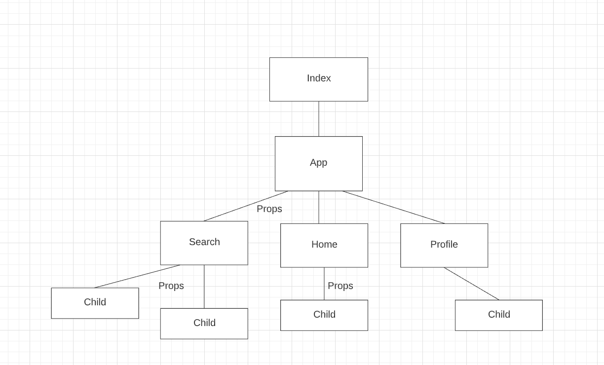

# Props and Component Structuring

## Resources

- [Components and Props](https://reactjs.org/docs/components-and-props.html)
- [Thinking In React](https://reactjs.org/docs/thinking-in-react.html)
- [Container Components](https://medium.com/@learnreact/container-components-c0e67432e005)
- [Separation of Concerns](https://en.wikipedia.org/wiki/Separation_of_concerns)

## Vocabulary

- Props
- Functional Components
- Container Components
- Display Components

## Objectives

- Understand what props are and what problem they solve
- Build an application that uses props
- Articulate the distinction between container and display components

# Introduction to props

In previous lessons, we've seen how to build React components and display them on a website. However, we had no way to make two different versions of the same component. For example, we should be able to create a `UserProfile` component with the name "Robert Kahn", then create a separate `UserProfile` component with the name "Vinton Cerf".

Another example of this is Amazon's product search. Take a look at, say, a search for t-shirts:


Each of these t-shirt listings represents a separate instance of the **exact same component**. This component is reused in many different places in the application.

In order to have the same component display different information, we can use **props**.

## Props

Props allow components to **pass information** to child components that they're rendering. Components can use props to consume data from their parents and render it to the user. This permits us to reuse the same component with relative ease. For example, we don't need distinct `UserProfile` components if each user's profile consumes the same shape of information and renders that information in the same way. We can use the same component and pass down unique user information as props.

Props also allow us to intelligently divide responsibilities between components. We can create components whose only job is to fetch, store, and update information, and we can have components whose only job is to receive props and render information. More on that separation of concerns in a future lesson.

Returning to our Amazon search page example, let's say our components (`ProductItem`) are the _child components_ of a component for the entire page (`ProductPage`). `ProductPage` stores the result of a large network request on the first render of the page, getting an array with fifty products. We then map through this array and send each individual product to a `ProductItem` component by way of props, which processes the product's information into something user-facing.

Let's take a look at a small-scale example of this.

# Simple example

Props are passed from a parent component to a child component. This is similar to how we call a function and pass arguments to it! Under the hood, this is actually what react is doing.

The syntax here looks very similar to writing HTML attributes, and that is by design.

Parent component:

```js
// App.js
const App = () => {
  let userDetails = {
    name: "Jimmy B",
    userId: 7348,
    email: "jimmy@pursuit.org"
  }
  return <User name={userDetails.name} />
}
```

Child component:

```js
const User = (props) => {
  const { name } = props

  return (
    <div className="user-details">
      <h1>{name}</h1>
    </div>
  )
}
```

Note that we are only passing in one prop. If we want to add more, we can just pass them to the child component with more key/value pairs.

```js
// App.js
const App = () => {
  let userDetails = {
    name: "Jimmy B",
    userId: 7348,
    email: "jimmy@pursuit.org"
  }
  return <User name={userDetails.name} userId={userDetails.userId} />
}
```

When the code gets too long, we can put each k/v pair on its own line.

```js
// App.js
const App = () => {
  
  let userDetails = {
    name: "Jimmy B",
    userId: 7348,
    email: "jimmy@pursuit.org"
  }

  return (
    <User 
      name={userDetails.name} 
      userId={userDetails.userId} 
      email={userDetails.email}
    />
  )
}
```

> Bonus: What if we used the spread operator here?

# Building an app using props

Here, we will build a simple application that uses props to display a list of shoes.


### `ProductPage.js`

```js
import React from 'react';
import ProductItem from './ProductItem';

const ProductPage = () => {

  // You can see here that we start our functional `ProductPage` component with an array of objects, each with certain consistent traits: `name`, `manufacturer`, and `price`.

  const products = [
      { name: "Ultra Boost", manufacturer: "Adidas", price: 160 },
      { name: "Air Force One Low", manufacturer: "Nike", price: 100 },
      { name: "Classic Leather", manufacturer: "Reebok", price: 120 },
      { name: "Sk8-Hi", manufacturer: "Vans", price: 60 }
    ];

  // We then then use this array to render our products in JSX:

  const listItems = products.map(product => {
    return (
      <ProductItem
        name={product.name}
        price={product.price}
      />
    );
  });

  return (
    <div>
      <ul>{listItems}</ul>
    </div>
  );
}
}
```

First, we're creating a variable called `listItems`, which maps through our `products` and returns React components named `ProductItem`. These `ProductItem` components have three attributes that correspond to keys of the objects in our `products` array. At first glance, however, these attributes might look confusing. They definitely aren't anything we've seen before in HTML. That's because, **while these items share the same syntax, they don't translate directly to HTML attributes.** Instead, they represent _props_ that we're passing down to our `ProductItem` components.

Think of props as arguments for a component. They compile into an attribute on the component which we can reference using `this.props` (in the case of a class component) or as our function's argument (for a functional component). In this case, for each item in our `products` array, we're inputting the name, manufacturer, and price into our `ProductItem` component. You'll notice, because this component is only responsible for receiving props and rendering data, we're making this one functional, rather than using a class:

### `ProductItem.js`

```js
import React from "react"

const ProductItem = (props) => {
  const { name, price } = props
  return (
    <li>
      {name} - ${price}
    </li>
  )
}

export default ProductItem
```

This is the entire `ProductItem` component. Pretty clean, right? Let's break this down.

We define `ProductItem` as an anonymous function that takes its `props` as an argument. `ProductItem` then uses object destructuring to break out two of those _same props that we passed into `ProductItem` in the `ProductPage` component_. Finally, we place our three items in an `li` tag, which our component returns.

Importantly, what you're seeing on the right-hand side of the sandbox is **four separate instances** of this component, each with different props. We create those instances in our `map` method in our parent component.

_Exercise: Notice that the objects in our `products` array have a third key: `manufacturer`. Pass this key down to each `ProductItem` and render it alongside `name` and `price`._

# Props in class components

For React function components, we saw that you can add `props` as the argument to the function:

```js
import React from "react"

const UserProfile = (props) => {
  const { name, age, location } = props
  return (
    <ul>
      <li>Name: {name}</li>
      <li>Age: {age}</li>
      <li>Location: {location}</li>
    </ul>
  )
}

export default ProductItem
```

In a React class component, props are accessed differently. Instead of using arguments to a function, you can access props with the expression `this.props`. This is because class components extend `React.Component`, which has a `props` attribute.

Note that we aren't even including a constructor, because we don't have to!

```js
import React from "react"

class UserProfile extends React.Component {
  render() {
    const { name, age, location } = this.props
    return (
      <ul>
        <li>Name: {name}</li>
        <li>Age: {age}</li>
        <li>Location: {location}</li>
      </ul>
    )
  }
}

export default ProductItem
```

_Exercise 1: For `UserProfile`, the function and class component access props differently. What differences do you notice?_

_Exercise 2: In the `UserProfile` class component, `this.props` is accessed inside the `render()` method. What do you think will happen if we move that line of code outside the render method? Where else could you put it?_

_Exercise 3: Refactor the `ProductItem` component above to be a class component. Make sure it still handles props._

# Component Architecture

In our previous example, you might have noticed that our `ProductPage` component doesn't really render much of anything independently. Its main purpose is to handle its data and send props down to child components. It's only when we get to the `ProductItem` components that we actually render something that looks even close to HTML.

This is a design philosophy called **separation of concerns**, which means that we should break out different functionalities into different parts of our app.

Why is this important? Well, let's go back to our Amazon example. Product items can show up on the homepage, on search index pages, **or** as a recommended/related item on a product page. If we simply have `Home`, `Search` and `Product` components that handle all rendering, we'll have to re-write the same JSX to render the same product previews. Much easier and more efficient to make a `ProductItem` or `ProductThumbnail` component and use it across all of these pages. So, the top-level pages handle their data, but they all feed into the same child components.

Additionally, if we have a parent component that does a single API request and passes the result down as props to several different components, as we saw above, we can avoid a situation where each separate component fires an AJAX request, which would be taxing to our backend server or remote API.

Finally, it keeps us organized and it keeps our app consistent. The higher up in our component structure we can store state, and the more components share the same state, the more consistently we present information to the user, and the less we have to update the same information in different places.

Separating our components into these two categories is a pattern known as `Smart Components` and `Dumb Components`. Sometimes also called `Container Components` and `Pure Components`. 

At the end of the day, a full-fledged app should have this general kind of component structure:



## Conclusion

Clearly, there's a lot of syntax we're introducing to you here, but there's also a lot of creative work that goes into deciding exactly what information should be stored in which component, which component should display what, and so on. We highly recommend thinking about this stuff as early as possible when you get around to building your own full-scale React projects!
